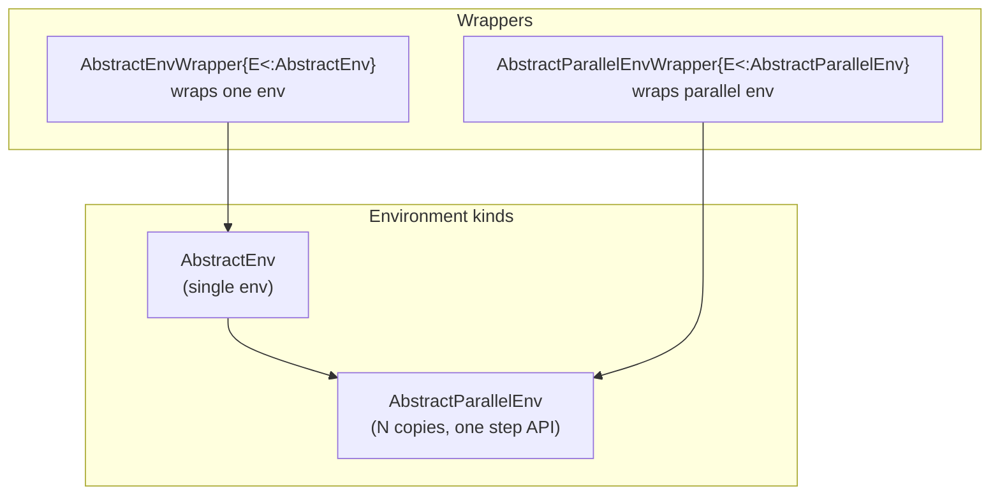

# Environments

## Dependencies for environment implementers

Packages or code that only implement environments should depend on **DrillInterface**, not Drill. DrillInterface is lightweight (minimal dependencies) and provides the types and function signatures needed to implement [`AbstractEnv`](@ref). Add **Drill** when you need training (PPO, SAC), built-in parallel runners ([`BroadcastedParallelEnv`](@ref), [`MultiThreadedParallelEnv`](@ref)), or training-oriented wrappers (for example [`NormalizeWrapperEnv`](@ref), [`MonitorWrapperEnv`](@ref)). Environment validation (`check_env`) is provided by DrillInterface; Drill re-exports it for convenience. DrillInterface ships from the same repository as Drill.

---

## Types: how the pieces fit together

Drill splits **single-step** environments from **vectorized (parallel)** ones, and splits **wrappers** the same way.



| Type | What it represents | Typical examples |
|------|--------------------|------------------|
| [`AbstractEnv`](@ref) | One Markov decision process instance | `CartPoleEnv`, your physics sim |
| [`AbstractParallelEnv`](@ref) | Several **independent** env instances stepped together; training sees a batch | [`BroadcastedParallelEnv`](@ref), [`MultiThreadedParallelEnv`](@ref), [`MultiAgentParallelEnv`](@ref) |
| [`AbstractEnvWrapper`](@ref) | Decorates **one** [`AbstractEnv`](@ref); still a single env to callers | [`ScalingWrapperEnv`](@ref) (in Drill) |
| [`AbstractParallelEnvWrapper`](@ref) | Decorates **one** [`AbstractParallelEnv`](@ref); still parallel to callers | [`NormalizeWrapperEnv`](@ref), [`MonitorWrapperEnv`](@ref) |

Important details:

- **`AbstractParallelEnv <: AbstractEnv` in Julia**, so a parallel env is an `AbstractEnv` in the type system. Algorithms and utilities still **dispatch on `AbstractParallelEnv`** when they need batched observations, batched flags, and the parallel `act!` return tuple—so implement the **parallel contracts** below when you subtype `AbstractParallelEnv`.
- **`is_wrapper`** ([`is_wrapper`](@ref)): for a value typed as `AbstractParallelEnv`, only [`AbstractParallelEnvWrapper`](@ref) counts as a wrapper. A plain [`AbstractParallelEnv`](@ref) is not a wrapper even though it contains sub-envs.
- **`unwrap` / `unwrap_all`**: define `unwrap` on your wrapper type to return the inner environment. `unwrap_all` peels repeated wrapper layers until [`is_wrapper`](@ref) is false; call it only on chains that start with a wrapper. On [`BroadcastedParallelEnv`](@ref), `unwrap_all` returns the `Vector` of underlying [`AbstractEnv`](@ref) instances (Drill extends the DrillInterface fallback).

---

## Single environment: [`AbstractEnv`](@ref)

Implement a concrete subtype of [`AbstractEnv`](@ref) and the methods below. This is the only type most domain packages need to define; Drill’s parallel runners wrap **vectors of** these envs.

### Single-env methods

| Method | Contract |
|--------|----------|
| [`reset!(env)`](@ref) | Puts the env in an initial state. Implementations in Drill typically return `nothing`; callers use [`observe(env)`](@ref) after reset. |
| [`act!(env, action)`](@ref) | Applies **one** action for that instance. Returns the **scalar reward** (same numeric type you use elsewhere, often `Float32`). |
| [`observe(env)`](@ref) | Current observation; must match [`observation_space(env)`](@ref) (shape and element type). |
| [`terminated(env)`](@ref), [`truncated(env)`](@ref) | Each returns `Bool`. |
| [`action_space(env)`](@ref), [`observation_space(env)`](@ref) | [`AbstractSpace`](@ref) values ([`Box`](@ref), [`Discrete`](@ref), …). |
| [`get_info(env)`](@ref) | Returns a **single** `Dict` (may be empty). |

Episode boundaries are **not** auto-handled for a single env: after `terminated` or `truncated` is true, the **trainer or evaluation code** calls [`reset!`](@ref) before the next episode.

### Minimal skeleton

```julia
struct MyEnv <: AbstractEnv
    # ...
end

DrillInterface.reset!(env::MyEnv) = ...
DrillInterface.act!(env::MyEnv, action) = ...  # returns reward
DrillInterface.observe(env::MyEnv) = ...
DrillInterface.terminated(env::MyEnv) = ...
DrillInterface.truncated(env::MyEnv) = ...
DrillInterface.action_space(env::MyEnv) = ...
DrillInterface.observation_space(env::MyEnv) = ...
DrillInterface.get_info(env::MyEnv) = Dict{String, Any}()
```

Optional but recommended: store an `rng` field and support `Random.seed!(env, seed)` (DrillInterface provides a default that seeds `env.rng` when that field exists).

---

## Parallel environment: [`AbstractParallelEnv`](@ref)

A parallel env owns **`N`** single-env instances and exposes **one** stepped interface to training code. PPO-style collection in Drill calls [`observe`](@ref), then [`act!`](@ref) with **one action per sub-env**, then [`observe`](@ref) again.

### When you implement `AbstractParallelEnv` yourself

Most users **do not** subtype [`AbstractParallelEnv`](@ref) directly. They implement [`AbstractEnv`](@ref) once and build:

```julia
env = BroadcastedParallelEnv([MyEnv() for _ in 1:N])
# or
env = MultiThreadedParallelEnv([MyEnv() for _ in 1:N])
```

Implement a **custom** [`AbstractParallelEnv`](@ref) only if you need different batching, remote workers, or a process model that these structs do not cover. Then you must match the **same contracts** as [`BroadcastedParallelEnv`](@ref) / [`MultiThreadedParallelEnv`](@ref) so algorithms and `check_env` stay consistent.

### Parallel batch methods

| Method | Parallel contract |
|--------|-------------------|
| [`number_of_envs(env)`](@ref) | **Required.** Returns `N`. |
| [`reset!(env)`](@ref) | Resets **all** sub-instances (often returns `nothing`). |
| [`observe(env)`](@ref) | Returns **one observation per sub-env**: either a `Vector` of length `N` (each element one obs) or a batched array whose last dimension is `N`, consistent with how policies in your pipeline read it. Built-in runners return `Vector` of observations. |
| [`terminated(env)`](@ref), [`truncated(env)`](@ref) | Each returns `AbstractVector{Bool}` of length `N`. |
| [`get_info(env)`](@ref) | Returns **per-env** info: `Vector` of `Dict` of length `N` (same stacking style as [`observe`](@ref) for composite types). |
| [`action_space`](@ref), [`observation_space`](@ref) | Same space as **each** sub-env (homogeneous spaces). If your struct stores sub-envs in an `envs` field, DrillInterface fallbacks can forward from `envs[1]`; otherwise define these explicitly. |
| [`act!(env, actions)`](@ref) | `actions` has **one entry per sub-env** (`length(actions) == number_of_envs(env)`). Returns a **tuple** `(rewards, terminateds, truncateds, infos)` where each is a vector of length `N`. |

### Auto-reset and truncation

Built-in parallel envs **auto-reset** a sub-env as soon as it is [`terminated`](@ref) or [`truncated`](@ref) after a step, so the batch always reflects post-reset state on the next [`observe`](@ref). For **truncation**, the info dict for that index should include `"terminal_observation"` with the last pre-reset observation; Drill uses this for value bootstrapping (see trajectory collection).

### Seeding

`Random.seed!(env::AbstractParallelEnv, seed)` in DrillInterface seeds `env.envs[i]` with `seed + i - 1`. If your custom parallel type does not use an `envs` field, override `Random.seed!` yourself.

### [`MultiAgentParallelEnv`](@ref)

[`MultiAgentParallelEnv`](@ref) is still an [`AbstractParallelEnv`](@ref): it flattens several parallel batches into **one** logical vector of length `total_envs` (possibly different group sizes). Use it when you intentionally combine multiple [`AbstractParallelEnv`](@ref) backends behind one interface.

---

## Wrappers: [`AbstractEnvWrapper`](@ref) vs [`AbstractParallelEnvWrapper`](@ref)

| Wrapper base | Wraps | Subtypes | Example in Drill |
|--------------|-------|----------|------------------|
| [`AbstractEnvWrapper{E<:AbstractEnv}`](@ref) | One [`AbstractEnv`](@ref) | Still [`AbstractEnv`](@ref), **not** [`AbstractParallelEnv`](@ref) | [`ScalingWrapperEnv`](@ref) |
| [`AbstractParallelEnvWrapper{E<:AbstractParallelEnv}`](@ref) | One [`AbstractParallelEnv`](@ref) | Still [`AbstractParallelEnv`](@ref) | [`NormalizeWrapperEnv`](@ref), [`MonitorWrapperEnv`](@ref) |

**Composition rules:**

- **Normalize / monitor training:** wrap the **parallel** env: `NormalizeWrapperEnv(BroadcastedParallelEnv([...]))`.
- **Scale observations and actions for a policy:** wrap each **single** env, then parallelize: `BroadcastedParallelEnv([ScalingWrapperEnv(MyEnv()) for _ in 1:N])`. Putting [`ScalingWrapperEnv`](@ref) outside the parallel runner would not match the single-env API Drill expects for that wrapper.
- Implement **`unwrap(wrapper) = wrapper.env`** (or the field holding the inner env) so `unwrap_all` and logging utilities can reach the inside.

Further wrapper-specific options are in the [Environment Wrappers](./wrappers.md) guide page.

---

## Spaces

```julia
# Continuous actions/observations
Box{Float32}(low, high)  # low/high are arrays; shapes must match

# Discrete actions
Discrete(n)              # Actions: 1, 2, ..., n
Discrete(n, start = 0) # Actions: 0, 1, ..., n-1
```

---

## Built-in parallel runners (recommended)

```julia
# Single-threaded broadcast (often best for cheap envs)
env = BroadcastedParallelEnv([MyEnv() for _ in 1:n_envs])

# Multi-threaded stepping (when work per step is large enough to amortize threading)
env = MultiThreadedParallelEnv([MyEnv() for _ in 1:n_envs])
```

Both require **the same concrete env type** and **isequal** observation and action spaces across copies.

---

## Environment validation

```julia
check_env(env)  # Single AbstractEnv or AbstractParallelEnv
```

`check_env` exercises required methods and space consistency. Run it on a **single** [`AbstractEnv`](@ref) and on your full [`AbstractParallelEnv`](@ref) stack after wiring parallelization and wrappers.

---

## See also

- [Environment Wrappers](./wrappers.md) — normalize, scale, monitor APIs
- [Algorithms](./algorithms.md) — what each algorithm expects for `env`
- [API Reference](../api.md) — full docstrings for [`AbstractEnv`](@ref), [`AbstractParallelEnv`](@ref), and related methods
